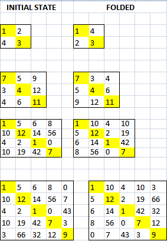

## Fold matrix from bottom left to top right ##

### Examples

### Output
<b>2X2 MATRIX</b> 
ORIGINAL
 
[1, 2] 
[4, 3]
  
FOLDED 
[1, 4] 
[2, 3]

<b>3X3 MATRIX</b> 
ORIGINAL 
[7, 5, 9] 
[3, 4, 12] 
[4, 6, 11]

FOLDED 
[7, 3, 4] 
[5, 4, 6] 
[9, 12, 11] 

<b>4X4 MATRIX</b> 
ORIGINAL 
[1, 5, 6, 8] 
[10, 12, 14, 56] 
[4, 2, 1, 0] 
[10, 19, 42, 7] 

FOLDED 
[1, 10, 4, 10] 
[5, 12, 2, 19] 
[6, 14, 1, 42] 
[8, 56, 0, 7] 

<b>5X5 MATRIX</b> 
ORIGINAL 
[1, 5, 6, 8, 0] 
[10, 12, 14, 56, 7] 
[4, 2, 1, 0, 43] 
[10, 19, 42, 7, 3] 
[3, 66, 32, 12, 9] 

FOLDED 
[1, 10, 4, 10, 3] 
[5, 12, 2, 19, 66] 
[6, 14, 1, 42, 32] 
[8, 56, 0, 7, 12] 
[0, 7, 43, 3, 9] 
